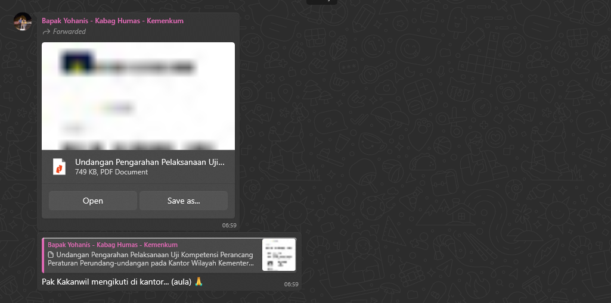
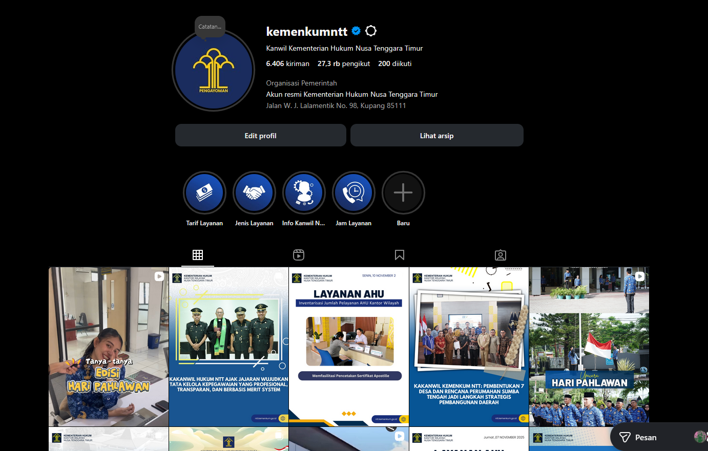

# Detail

Berikut merupakan deskripsi langkah-langkah detail dari Alur Publikasi Berita Kegiatan dalam Tim Humas:

## 1. Penerimaan Nota Dinas Peliputan Kegiatan
Tim Humas menerima nota dinas berupa permohonan, permintaan, atau perintah peliputan dan publikasi kegiatan dari masing-masing divisi, bagian, atau pimpinan tinggi. Nota dinas tersebut menjadi dasar bagi Tim Humas untuk menindaklanjuti peliputan kegiatan sesuai jadwal yang tercantum.

Berikut merupakan contoh chat nota dinas yang diterima yang akan diterima oleh Koordinator Tim Humas:

## 2. Delegasi Tugas oleh Koordinator Tim Humas
Setelah menerima nota dinas, Koordinator Tim Humas mendelegasikan tugas peliputan kegiatan kepada salah satu anggota Tim Humas. Penentuan anggota dilakukan dengan mempertimbangkan waktu, tempat, serta jenis kegiatan yang akan dilaksanakan.

1. Jika kegiatan dilakukan di luar kantor dan dihadiri oleh Kepala Kantor Wilayah, maka penugasan diberikan kepada anggota tim yang dinilai mampu melakukan peliputan di ruang publik dan berinteraksi dengan berbagai pihak eksternal.
2. Jika kegiatan berlangsung di dalam kantor dan tidak dihadiri oleh pimpinan tinggi, tetapi dilaksanakan pada pagi hari atau hari WFA/weekend, maka prioritas diberikan kepada anggota yang dapat hadir dan meliput lebih cepat.
3. Untuk kegiatan yang memerlukan persiapan Zoom Meeting, Koordinator akan menunjuk anggota tim yang memiliki akses ke akun Zoom Meeting resmi Kanwil untuk menyiapkan aspek teknis sebelum acara dimulai.

Berikut merupakan contoh chat delegasi tugas yang diberikan oleh Koordinator Tim Humas setiap paginya

!!!info Note
Pendelegasian sangat flexible sesuai dengan kondisi tim pada hari tersebut
!!!

## 3. Persiapan dan Kehadiran dalam Kegiatan
Anggota Tim Humas yang ditugaskan hadir sesuai waktu dan tempat yang tercantum dalam nota dinas. Persiapan yang dilakukan meliputi penyiapan ruangan, kamera, perangkat dokumentasi, serta pakaian (dress code) sesuai dengan jenis kegiatan. Untuk kegiatan di luar kantor, anggota juga perlu memperhatikan etika dan performa selama peliputan di ruang publik.

## 4. Peliputan dan Dokumentasi Kegiatan
Selama kegiatan berlangsung, anggota Tim Humas melakukan peliputan dengan mencatat poin-poin penting seperti sambutan, pesan utama pimpinan, serta isi materi narasumber. Dokumentasi kegiatan dilakukan dalam bentuk foto dan video, dengan fokus pada foto key event yang nantinya akan digunakan dalam publikasi di media sosial dan website.

## 5. Penyusunan Draft Artikel dan Seleksi Foto
Setelah kegiatan selesai, anggota Tim Humas menyusun draft artikel kegiatan berdasarkan hasil liputan dan memilih foto-foto terbaik dari dokumentasi yang diambil. Draft artikel dan foto tersebut kemudian diserahkan kepada Koordinator Tim Humas untuk proses evaluasi dan revisi sebelum dipublikasikan.

Berikut merupakan contoh draft artikel setelah dua kali revisi yang dibuat oleh salah satu anggota tim humas dengan menggunakan aplikasi Obsidian:

## 6. Publikasi di Website dan Media Sosial
Setelah melalui proses evaluasi, artikel dan foto kegiatan dipublikasikan di website resmi (ntt.kemenkum.go.id) dan di platform media sosial resmi Kanwil Kemenkum NTT, yaitu Instagram, Facebook, dan X (Twitter). Publikasi dilakukan secara manual oleh anggota tim yang telah ditugaskan.

Berikut merupakan tampilan berita yang telah dipublikasi pada website Kanwil Kemenkum NTT

Berikut juga merupakan tampilan instagram Kanwil Kemenkum NTT yang berisi berita yang dikemas dalam bentuk postingan media sosial:

## 7. Distribusi Informasi Melalui Grup WhatsApp
Setelah publikasi dilakukan, anggota Tim Humas membagikan cuplikan berita dan tautan (link) ke Grup WhatsApp resmi Kanwil Kemenkum NTT sebagai bentuk penyebarluasan informasi internal. Langkah ini juga berfungsi sebagai bentuk pelaporan informal kepada seluruh pegawai terkait kegiatan yang telah diliput dan dipublikasikan.

Berikut merupakan chat yang dikirim oleh tim humas ke Grup Utama Kanwil Kemenkum NTT sebagai pemberitahuan dan bukti bahwa kegiatan telah dipublikasikan:

